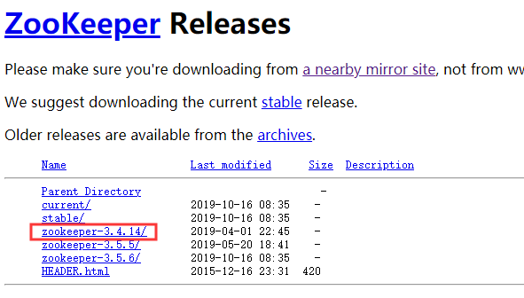

## 系统与软件版本

CentOS-7-x86_64-Everything 最小安装模式=》开发工具、安全性工具

Hadoop 2.8

Zookeeper 3.4

kafka_2.11-2.3.0

## 软件百度云下载

链接：https://pan.baidu.com/s/1_o6upcYSegaMDBFwL3SxEQ 
提取码：enou

## 机器IP管理

```
192.168.1.111	bigdata111
192.168.1.112	bigdata112
192.168.1.113	bigdata113
192.168.1.114	bigdata114
192.168.1.115	bigdata115
192.168.1.116	bigdata116
```

## 组件进程分配

- zookeeper进程所在机器
  bigdata111/bigdata112/bigdata113
- kafka进程所在机器
  bigdata111/bigdata112/bigdata113/bigdata114/bigdata115/bigdata116
- NameNode进程和zkfc进程所在机器
  bigdata111/bigdata112
- ResourceManager进程所在机器
  bigdata113/bigdata114
- DataNode进程和NodeManager进程所在机器
  bigdata111/bigdata112/bigdata113/bigdata114/bigdata115/bigdata116
- journalnode进程所在机器
  bigdata111/bigdata112/bigdata113
- JobHistoryServer进程（MR历史服务器）所在机器
  bigdata115


## 软件详细地址

### CentOS

http://mirrors.aliyun.com/centos/7/isos/x86_64/


### Hadoop

http://mirror.bit.edu.cn/apache/hadoop/common/


### Zookeeper

http://apache.fayea.com/zookeeper/



### Kafka

http://kafka.apache.org/downloads


