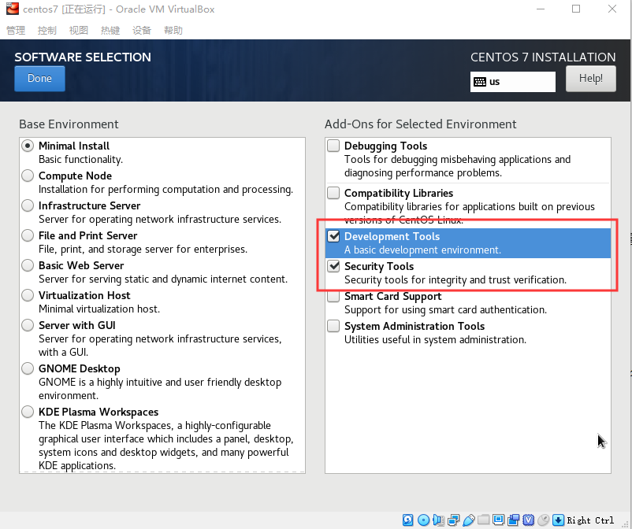

# 切换到root用户并进行以下所有操作

## 安装模式选择



## root密码设置

root密码设置为root

## 禁用安全系统

```shell
vi /etc/selinux/config
```

修改以下配置

```
SELINUX=disabled
```

## 禁用防火墙

关闭防火墙：systemctl stop firewalld

禁用防火墙：systemctl disable firewalld

查看防火墙：systemctl status firewalld

## 设置IP（桥接模式、静态IP）并能ping通外网

通过```ip addr```命令查看网卡名称（这里是enp0s3）

修改网卡配置文件内容

```shell
vi /etc/sysconfig/network-scripts/ifcfg-enp0s3
```

修改和添加以下配置项

此处假设桥接模式网段为192.168.1网段，当前LINUX虚拟主机IP为192.168.1.111

```
BOOTPROTO=static
ONBOOT=yes
IPADDR=192.168.1.111
GATEWAY=192.168.1.1
DNS1=8.8.8.8
NETMASK=255.255.255.0
```

## 修改DNS解析配置文件

```shell
vi /etc/resolv.conf
```

修改为以下内容

```
nameserver 8.8.8.8
```

## 重启网卡

```shell
systemctl restart network
```

## 安装psmisc工具

psmisc工具中包含fuser命令，是后面高可用集群防止脑裂过程会用到的重要命令

```shell
yum install -y psmisc
```

## 配置主机名

此处配置主机名为bigdata111

```shell
hostnamectl set-hostname bigdata111
```

## 卸载自带Open JDK，并安装Oracle JDK 1.8

查询是否安装java软件

```shell
rpm -qa|grep java
```

如果安装的版本不是1.8，卸载该jdk

```shell
rpm -e 软件包名字
```

上传并解压安装jdk-8u141-linux-x64.tar.gz （只要是jdk8即可）

```shell
tar -zxf jdk-8u141-linux-x64.tar.gz -C /opt
```

配置环境变量

```shell
vi /etc/profile
```

追加以下内容

```
# Java
export JAVA_HOME=/opt/jdk1.8.0_141
export PATH=$PATH:$JAVA_HOME/bin
```

保存并刷新环境变量

```shell
source /etc/profile
```

测试安装完成

```shell
java -version
```

## 配置六台机器的hosts文件

```shell
vi /etc/hosts
```

追加以下内容

```
192.168.1.111	bigdata111
192.168.1.112	bigdata112
192.168.1.113	bigdata113
192.168.1.114	bigdata114
192.168.1.115	bigdata115
192.168.1.116	bigdata116
```

## 创建普通用户（用于使用hadoop）

这里假设要创建一个名为hadoop的用户，并设置密码为root

```shell
adduser hadoop
passwd hadoop
```

设置hadoop用户具有root权限

```shell
sudo vi /etc/sudoers 
```

在92行找到：

```
root    ALL=(ALL)       ALL
```

在它下面添加一行（使用```:wq!```保存）：

```
hadoop    ALL=(ALL)       ALL
```

## 集群时钟同步配置1

### 安装ntp和ntpdate工具

```shell
yum install -y ntp ntpdate
```

### 修改/etc/ntp.conf配置文件

```shell
vi /etc/ntp.conf
```

#### 修改1

授权192.168.1.0-192.168.1.255网段上的所有机器可以从这台机器上查询和同步时间

```
#restrict 192.168.1.0 mask 255.255.255.0 nomodify notrap
```

由于本地六台虚拟机的IP是192.168.1.111-116，

修改为

```
restrict 192.168.1.0 mask 255.255.255.0 nomodify notrap
```

#### 修改2（集群不使用互联网上时间，使用本地计算机时间）

```
server 0.centos.pool.ntp.org iburst
server 1.centos.pool.ntp.org iburst
server 2.centos.pool.ntp.org iburst
server 3.centos.pool.ntp.org iburst
```

修改为

```
#server 0.centos.pool.ntp.org iburst
#server 1.centos.pool.ntp.org iburst
#server 2.centos.pool.ntp.org iburst
#server 3.centos.pool.ntp.org iburst
```

#### 添加3（当该节点丢失网络连接，依然可以采用本地时间作为标准时间服务器）

```
server 127.127.1.0
fudge 127.127.1.0 stratum 10
```

### 修改/etc/sysconfig/ntpd 文件

目的是让硬件时间与系统时间一起同步

```shell
 vi /etc/sysconfig/ntpd
```

增加内容

```
SYNC_HWCLOCK=yes
```

### 设置ntpd服务开机自启

```
systemctl enable ntpd
```

查看ntpd服务状态

```shell
systemctl status ntpd
```

ntpd (pid  2597) 正在运行...

若ntpd服务关闭，启动

```shell
systemctl start ntpd
```

## 另外五台虚拟主机参照如上所有操作进行（注意修改IP和主机名）

## 集群时钟同步配置2

其他服务器配置

编写crontab脚本，**在其他五台机器(bigdata112~bigdata116)配置**每隔10min与标准时间服务器bigdata111同步一次

```shell
crontab -e
```


编写定时任务如下，定时10分钟同步一次

```
*/10 * * * * /usr/sbin/ntpdate bigdata111
```

## 配置集群间root用户的ssh免密登陆

### 在集群每个节点机器上生成公钥和私钥

```shell
ssh-keygen -t rsa
```

回车后再连续按下三次回车

### 将刚生成的公钥发送到每台机器上，包过机器本身也要发送

```shell
ssh-copy-id bigdata111
ssh-copy-id bigdata112
ssh-copy-id bigdata113
ssh-copy-id bigdata114
ssh-copy-id bigdata115
ssh-copy-id bigdata116
```

