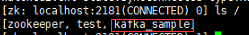

# 切换到hadoop用户并进行以下所有操作

## 配置集群间hadoop用户的ssh免密登陆

### 在集群每个节点机器上生成公钥和私钥

```shell
ssh-keygen -t rsa
```

回车后再连续按下三次回车

### 将刚生成的公钥发送到每台机器上，包过机器本身也要发送

```shell
ssh-copy-id bigdata111
ssh-copy-id bigdata112
ssh-copy-id bigdata113
ssh-copy-id bigdata114
ssh-copy-id bigdata115
ssh-copy-id bigdata116
```

## 安装zookeeper（完全分布式）

### zookeeper的基本概念和功能

https://blog.51cto.com/12445535/2351885

### 安装目标

在bigdata111~bigdata113三台机器上进行安装，构成的zookeeper集群是三节点集群，以下操作在bigdata111上进行。

### 上传并解压安装zookeeper

```shell
tar -zxf zookeeper-3.4.14.tar.gz -C /home/hadoop/
```

### 创建目录

```shell
mkdir /home/hadoop/zookeeper-3.4.14/data
```

### 复制并重命名zoo_sample.cfg为zoo.cfg

```shell
cp  /home/hadoop/zookeeper-3.4.14/conf/zoo_sample.cfg /home/hadoop/zookeeper-3.4.14/conf/zoo.cfg
```

### 修改zoo.cfg内容

```shell
vi  /home/hadoop/zookeeper-3.4.14/conf/zoo.cfg
```

修改并添加以下配置

```
dataDir=/home/hadoop/zookeeper-3.4.14/data
server.1=bigdata111:2888:3888
server.2=bigdata112:2888:3888
server.3=bigdata113:2888:3888
```

### 修改zookeeper运行日志zookeeper.out的位置

#### 修改conf/log4j.properties文件

```shell
vi /home/hadoop/zookeeper-3.4.14/conf/log4j.properties
```

以下配置项修改为

```
zookeeper.root.logger=INFO, ROLLINGFILE
```

#### 修改bin/zkEnv.sh

```
vi /home/hadoop/zookeeper-3.4.14/bin/zkEnv.sh
```

以下配置项修改为

```
if [ "x${ZOO_LOG_DIR}" = "x" ]
then
    ZOO_LOG_DIR="/home/hadoop/zookeeper-3.4.14/log"
fi

if [ "x${ZOO_LOG4J_PROP}" = "x" ]
then
    ZOO_LOG4J_PROP="INFO,ROLLINGFILE"
fi
```

### 将经过以上配置的zookeeper目录拷贝到bigdata112和bigdata113

```shell
scp -r /home/hadoop/zookeeper-3.4.14/ bigdata112:/home/hadoop/
scp -r /home/hadoop/zookeeper-3.4.14/ bigdata113:/home/hadoop/
```

### 在三个节点上创建myid文件

在```/home/hadoop/zookeeper-3.4.8/data```目录下创建一个myid文件，里面根据上述配置填上server.x中的数字x

例如：

bigdata111机器上的zookeeper中的data目录下的myid文件中填的就是1;

bigdata112机器上的zookeeper中的data目录下的myid文件中填的就是2;

bigdata113机器上的zookeeper中的data目录下的myid文件中填的就是3;

使用命令就是

```shell
ssh bigdata111 'echo "1" > /home/hadoop/zookeeper-3.4.14/data/myid'
ssh bigdata112 'echo "2" > /home/hadoop/zookeeper-3.4.14/data/myid'
ssh bigdata113 'echo "3" > /home/hadoop/zookeeper-3.4.14/data/myid'
```

### 配置三个节点上的zookeeper环境变量并刷新

需要为这三个节点都添加zookeeper环境变量，并使用```source /home/hadoop/.bash_profile```使其生效

```
# zookeeper
export ZOOKEEPER_HOME=/home/hadoop/zookeeper-3.4.14
export PATH=$PATH:$ZOOKEEPER_HOME/bin
```

因此执行以下命令

```shell
ssh bigdata111 "echo '' >> /home/hadoop/.bash_profile"
ssh bigdata111 "echo '# zookeeper' >> /home/hadoop/.bash_profile"
ssh bigdata111 "echo 'export ZOOKEEPER_HOME=/home/hadoop/zookeeper-3.4.14' >> /home/hadoop/.bash_profile"
ssh bigdata111 "echo 'export PATH=\$PATH:\$ZOOKEEPER_HOME/bin' >> /home/hadoop/.bash_profile"

ssh bigdata112 "echo '' >> /home/hadoop/.bash_profile"
ssh bigdata112 "echo '# zookeeper' >> /home/hadoop/.bash_profile"
ssh bigdata112 "echo 'export ZOOKEEPER_HOME=/home/hadoop/zookeeper-3.4.14' >> /home/hadoop/.bash_profile"
ssh bigdata112 "echo 'export PATH=\$PATH:\$ZOOKEEPER_HOME/bin' >> /home/hadoop/.bash_profile"

ssh bigdata113 "echo '' >> /home/hadoop/.bash_profile"
ssh bigdata113 "echo '# zookeeper' >> /home/hadoop/.bash_profile"
ssh bigdata113 "echo 'export ZOOKEEPER_HOME=/home/hadoop/zookeeper-3.4.14' >> /home/hadoop/.bash_profile"
ssh bigdata113 "echo 'export PATH=\$PATH:\$ZOOKEEPER_HOME/bin' >> /home/hadoop/.bash_profile"
```

然后登陆到三个节点上手动执行以下命令刷新环境变量

```shell
source /home/hadoop/.bash_profile
```

### zookeeper集群的启停

需要在各个安装了zookeeper的节点上都执行启停命令

```shell
zkServer.sh start		--启动（启动成功后，各节点执行jps命令会显示QuorumPeerMain进程）
zkServer.sh status	--查看状态
zkServer.sh stop		--停止
```

### 操作zookeeper（了解）

Zookeeper相当于一个文件系统，我们可以进入它的内部，对文件进行增删查操作
进入命令：zkCli.sh（只需要在其中任意一个节点上执行即可）
创建文件命令：create /test “6545432i3po21irhnje;lqrek;lwqjk”
查看文件内容：get /test
删除该文件命令：rmr /test

## 安装kafka（完全分布式）

安装部署（运行）kafka集群的前提是，已经安装部署（运行）了zookeeper集群

### 安装目标

在bigdata111~bigdata116六台机器上进行安装，构成的kafka集群是六节点集群，以下操作在bigdata111上进行。

### 上传并解压安装kafka
```shell
tar -zxf kafka_2.11-2.3.0.tgz -C /home/hadoop
```

### 创建日志目录
```shell
mkdir -p /home/hadoop/kafka_2.11-2.3.0/data/logs/
```

### 拷贝config/server.properties到config/myserver.properties

```shell
cd /home/hadoop/kafka_2.11-2.3.0
cp config/server.properties config/myserver.properties
```

### 将经过以上配置的kafka目录bigdata112~bigdata116上

```shell
scp -r /home/hadoop/kafka_2.11-2.3.0/ bigdata112:/home/hadoop/
scp -r /home/hadoop/kafka_2.11-2.3.0/ bigdata113:/home/hadoop/
scp -r /home/hadoop/kafka_2.11-2.3.0/ bigdata114:/home/hadoop/
scp -r /home/hadoop/kafka_2.11-2.3.0/ bigdata115:/home/hadoop/
scp -r /home/hadoop/kafka_2.11-2.3.0/ bigdata116:/home/hadoop/
```

### 修改config/myserver.properties内容（六台节点都要修改）

```shell
vi /home/hadoop/kafka_2.11-2.3.0/config/myserver.properties
```

修改以下配置

```broker.id``` =>服务器唯一标识符，各个节点应该不同，例如 bigdata111 就 1，bigdata112 就 2，bigdata113 就3；

```listeners``` =>服务器监听的主机名和端口号，各个节点应该不同，**监听的是所在节点的主机名和端口**；

```log.dirs``` =>这个目录就是用来存储kafka生产者产生的日志数据

```zookeeper.connect``` =>zookeeper链接地址,这里表示kafka元数据信息存储在由bigdata111/bigdata112/bigdata113这三个节点构成的zookeeper集群中的kafka_sample目录下;

所以从bigdata111~bigdata116的config/myserver.properties分别需要修改以下配置

```
broker.id=1
listeners=PLAINTEXT://bigdata111:9092
log.dirs=/home/hadoop/kafka_2.11-2.3.0/data/logs/
zookeeper.connect=bigdata111:2181,bigdata112:2181,bigdata113:2181/kafka_sample
```

```
broker.id=2
listeners=PLAINTEXT://bigdata112:9092
log.dirs=/home/hadoop/kafka_2.11-2.3.0/data/logs/
zookeeper.connect=bigdata111:2181,bigdata112:2181,bigdata113:2181/kafka_sample
```

```
broker.id=3
listeners=PLAINTEXT://bigdata113:9092
log.dirs=/home/hadoop/kafka_2.11-2.3.0/data/logs/
zookeeper.connect=bigdata111:2181,bigdata112:2181,bigdata113:2181/kafka_sample
```

```
broker.id=4
listeners=PLAINTEXT://bigdata114:9092
log.dirs=/home/hadoop/kafka_2.11-2.3.0/data/logs/
zookeeper.connect=bigdata111:2181,bigdata112:2181,bigdata113:2181/kafka_sample
```

```
broker.id=5
listeners=PLAINTEXT://bigdata115:9092
log.dirs=/home/hadoop/kafka_2.11-2.3.0/data/logs/
zookeeper.connect=bigdata111:2181,bigdata112:2181,bigdata113:2181/kafka_sample
```

```
broker.id=6
listeners=PLAINTEXT://bigdata116:9092
log.dirs=/home/hadoop/kafka_2.11-2.3.0/data/logs/
zookeeper.connect=bigdata111:2181,bigdata112:2181,bigdata113:2181/kafka_sample
```

### 配置六个节点上的kafka环境变量并刷新

需要为这六个节点都添加kafka环境变量，并使用```source /home/hadoop/.bash_profile```使其生效

```
# kafka
export KAFKA_HOME=/home/hadoop/kafka_2.11-2.3.0
export PATH=$PATH:$KAFKA_HOME/bin
```

因此执行以下命令

```shell
ssh bigdata111 "echo '' >> /home/hadoop/.bash_profile"
ssh bigdata111 "echo '# kafka' >> /home/hadoop/.bash_profile"
ssh bigdata111 "echo 'export KAFKA_HOME=/home/hadoop/kafka_2.11-2.3.0' >> /home/hadoop/.bash_profile"
ssh bigdata111 "echo 'export PATH=\$PATH:\$KAFKA_HOME/bin' >> /home/hadoop/.bash_profile"

ssh bigdata112 "echo '' >> /home/hadoop/.bash_profile"
ssh bigdata112 "echo '# kafka' >> /home/hadoop/.bash_profile"
ssh bigdata112 "echo 'export KAFKA_HOME=/home/hadoop/kafka_2.11-2.3.0' >> /home/hadoop/.bash_profile"
ssh bigdata112 "echo 'export PATH=\$PATH:\$KAFKA_HOME/bin' >> /home/hadoop/.bash_profile"

ssh bigdata113 "echo '' >> /home/hadoop/.bash_profile"
ssh bigdata113 "echo '# kafka' >> /home/hadoop/.bash_profile"
ssh bigdata113 "echo 'export KAFKA_HOME=/home/hadoop/kafka_2.11-2.3.0' >> /home/hadoop/.bash_profile"
ssh bigdata113 "echo 'export PATH=\$PATH:\$KAFKA_HOME/bin' >> /home/hadoop/.bash_profile"

ssh bigdata114 "echo '' >> /home/hadoop/.bash_profile"
ssh bigdata114 "echo '# kafka' >> /home/hadoop/.bash_profile"
ssh bigdata114 "echo 'export KAFKA_HOME=/home/hadoop/kafka_2.11-2.3.0' >> /home/hadoop/.bash_profile"
ssh bigdata114 "echo 'export PATH=\$PATH:\$KAFKA_HOME/bin' >> /home/hadoop/.bash_profile"

ssh bigdata115 "echo '' >> /home/hadoop/.bash_profile"
ssh bigdata115 "echo '# kafka' >> /home/hadoop/.bash_profile"
ssh bigdata115 "echo 'export KAFKA_HOME=/home/hadoop/kafka_2.11-2.3.0' >> /home/hadoop/.bash_profile"
ssh bigdata115 "echo 'export PATH=\$PATH:\$KAFKA_HOME/bin' >> /home/hadoop/.bash_profile"

ssh bigdata116 "echo '' >> /home/hadoop/.bash_profile"
ssh bigdata116 "echo '# kafka' >> /home/hadoop/.bash_profile"
ssh bigdata116 "echo 'export KAFKA_HOME=/home/hadoop/kafka_2.11-2.3.0' >> /home/hadoop/.bash_profile"
ssh bigdata116 "echo 'export PATH=\$PATH:\$KAFKA_HOME/bin' >> /home/hadoop/.bash_profile"
```

然后登陆到六个节点上手动执行以下命令刷新环境变量

```shell
source /home/hadoop/.bash_profile
```

### kafka集群的启停（需要在各个安装了kafka的节点上都执行启停命令）

启动的前提条件：先启动zookeeper集群

启动：（启动成功后，各节点执行jps命令会显示Kafka进程，且可在zookeeper集群中看到kafka_sample目录）

```shell
kafka-server-start.sh -daemon $KAFKA_HOME/config/myserver.properties
```



停止：

```shell
kafka-server-stop.sh
```

kafka数据区分

kafka是由生产者与消费者来进行数据的发送、接收，而他们发送数据的最小单元是以一个topic(主题)来区分的

创建topic（以下四个参数必选，在kafka集群的任意一个节点执行即可）

```shell
kafka-topics.sh --create --topic mytopic --zookeeper bigdata111:2181,bigdata112:2181,bigdata113:2181/kafka_sample --partitions 6 --replication-factor 2
```

各参数解释：
```--create –-topic mytopic```		表示创建名称为mytopic的topic
```--zookeeper``` bigdata111:2181,bigdata112:2181,bigdata113:2181/kafka_sample	表示zookeeper连接地址
```--partitions``` 6				表示指定分区数为6
```--replication-factor``` 2		表示kafka存储数据的副本数为2

查看创建的所有topic

```shell
kafka-topics.sh --list --zookeeper bigdata111:2181,bigdata112:2181,bigdata113:2181/kafka_sample
```

 

删除指定topic（这里以mytopic为例）

```shell
kafka-topics.sh --delete --zookeeper bigdata111:2181,bigdata112:2181,bigdata113:2181/kafka_sample --topic mytopic
```

查看指定topic数据的分区和副本数（这里以mytopic为例）

```shell
kafka-topics.sh --zookeeper bigdata111:2181,bigdata112:2181,bigdata113:2181/kafka_sample --describe --topic mytopic
```

启动kafka内置的生产者、消费者，测试产生数据、接收数据

- 启动生产者（在其中一个节点上启动并输入数据）

  ```shell
  kafka-console-producer.sh --topic mytopic --broker-list bigdata111:9092,bigdata112:9092,bigdata113:9092,bigdata114:9092,bigdata115:9092,bigdata116:9092
  ```

  ```--broker-list```表示broker的列表

- 启动消费者（在另一个节点上启动自动接收数据）

  ```shell
  kafka-console-consumer.sh --bootstrap-server bigdata111:9092,bigdata112:9092,bigdata113:9092,bigdata114:9092,bigdata115:9092,bigdata116:9092 --topic mytopic --from-beginning
  ```

  这个命令是新版kafka的命令，老版本用的不是```--bootstrap-server ...``` 而是```--zookeeper ...```
  此处带上```--from-beginning```，表示从日志的最早日志开始消费，不带上则表示从最新日志开始消费

## 安装hadoop

### 安装目标

在bigdata111~bigdata116六台机器上进行安装，构成的hadoop集群是六节点集群，以下操作在bigdata111上进行。

### 上传并解压hadoop包

#### 上传并解压安装hadoop

```
tar -zxf hadoop-2.8.5.tar.gz -C /home/hadoop
```

#### 删除英文说明文档，节省hadoop包远程拷贝时间

```
rm -rf /home/hadoop/hadoop-2.8.5/share/doc
```

#### 修改安装目录/etc/hadoop目录下的hadoop-env.sh、mapred-env.sh、yarn-env.sh

```
vi /home/hadoop/hadoop-2.8.5/etc/hadoop/hadoop-env.sh
vi /home/hadoop/hadoop-2.8.5/etc/hadoop/mapred-env.sh
vi /home/hadoop/hadoop-2.8.5/etc/hadoop/yarn-env.sh
```

对以上三个文件修改以下配置（这个jdk路径根据自己的集群环境而定）

```
export JAVA_HOME=/opt/jdk1.8.0_141
```

### 配置HDFS模块

> dfs.ha.fencing.methods 解释	https://segmentfault.com/a/1190000007239743
> /bin/shell 参考  https://codeday.me/bug/20170905/68037.html
> hdfs架构图	https://segmentfault.com/a/1190000018745678
> journalnode为啥奇数个 ？	http://wenda.chinahadoop.cn/question/443

#### 创建hdfs目录

```
mkdir /home/hadoop/hdfs
```

#### 修改core-site.xml

```
vi /home/hadoop/hadoop-2.8.5/etc/hadoop/core-site.xml
```

修改以下配置

```xml
<configuration>
  <property>
　　<!-- 用户HDFS命令模块中指定默认的文件系统协议 -->
　　<name>fs.defaultFS</name>
　　<value>hdfs://ns1</value>
　</property>
  <!-- 临时文件存储路径 -->
　<property>
　　<name>hadoop.tmp.dir</name>
　　<value>/home/hadoop/hdfs/tmp</value>
　</property>
  <!-- 告知系统运行的是zookeeper的服务，配置zookeeper的地址 -->
  <property>
    <name>ha.zookeeper.quorum</name>
    <value>bigdata111:2181,bigdata112:2181,bigdata113:2181</value>
  </property>
</configuration>
```

#### 修改hdfs-site.xml

```shell
vi /home/hadoop/hadoop-2.8.5/etc/hadoop/hdfs-site.xml
```

修改以下配置

```xml
<configuration>
	<!-- 指定副本个数(默认副本数为3，需根据实际需求更改) -->
	<property>
		<name>dfs.replication</name>
		<value>3</value>
	</property>
	<!-- 指定自定义的HDFS服务名 -->
	<property>
		<name>dfs.nameservices</name>
		<value>ns1</value>
	</property>
	<!-- 指定ns1名称下的两个节点 -->
	<property>
		<name>dfs.ha.namenodes.ns1</name>
		<value>nn1,nn2</value>
	</property>
	<!-- 指定两台namenode所在的机器位置及交互端口号(端口号默认8020) -->
	<property>
		<name>dfs.namenode.rpc-address.ns1.nn1</name>
		<value>bigdata111:8020</value>
	</property>
	<property>
		<name>dfs.namenode.rpc-address.ns1.nn2</name>
		<value>bigdata112:8020</value>
	</property>
	<!-- 指定两台namenode外部访问的交互端口号 -->
	<property>
		<name>dfs.namenode.http-address.ns1.nn1</name>
		<value>bigdata111:50070</value>
	</property>
	<property>
		<name>dfs.namenode.http-address.ns1.nn2</name>
		<value>bigdata112:50070</value>
	</property>
	<!-- 指定JournalNode日志节点（用于NameNode之间共享数据）的共享存储日志访问路径 -->
	<property>
		<name>dfs.namenode.shared.edits.dir</name>
		<value>qjournal://bigdata111:8485;bigdata112:8485;bigdata113:8485/ns1</value>
	</property>
	<!-- 指定JournalNode节点真正存储日志的实际路径-->
	<property>
		<name>dfs.journalnode.edits.dir</name>
		<value>/home/hadoop/hdfs/journalnode</value>
	</property>
	<!-- 配置客户端代理访问属性 -->
	<property>
		<name>dfs.client.failover.proxy.provider.ns1</name>
		<value>org.apache.hadoop.hdfs.server.namenode.ha.ConfiguredFailoverProxyProvider</value>
	</property>
	<!-- 指定SSH协议方式隔离（需确保已安装psmisc工具，在各个namenode节点机上安装）故障namenode节点，防止出现脑裂现象，并指定要用到的私钥路径，shell(/bin/true)查看上方参考-->
	<property>
		<name>dfs.ha.fencing.methods</name>
		<value>
			sshfence
			shell(/bin/true)
		</value>
	</property>
	<property>
		<name>dfs.ha.fencing.ssh.private-key-files</name>
		<value>/home/hadoop/.ssh/id_rsa</value>
	</property>
	<!-- 代表是否开启自动故障转移功能 -->
	<property>
	   <name>dfs.ha.automatic-failover.enabled</name>
	   <value>true</value>
	</property>
</configuration>
```

### 配置YARN模块及MR历史服务器

#### 修改yarn-site.xml

```shell
vi /home/hadoop/hadoop-2.8.5/etc/hadoop/yarn-site.xml
```

修改以下配置

```xml
<configuration>
	<!-- 指定yarn运行的是mapreduce -->
	<property>
		<name>yarn.nodemanager.aux-services</name>
		<value>mapreduce_shuffle</value>
	</property>
	<!-- 开启日志聚集功能 -->
	<property>
		<name>yarn.log-aggregation-enable</name>
		<value>true</value>
	</property>
	<!-- 配置日志在HDFS存储多久 -->
	<property>
		<name>yarn.log-aggregation.retain-seconds</name>
		<value>5086400</value>
	</property>
	<!-- 是否启用ResourceManager HA功能 -->
	<property>
		<name>yarn.resourcemanager.ha.enabled</name>
		<value>true</value>
	</property>
	<!-- 指定YARN集群的ID名称 -->
	<property>
	   <name>yarn.resourcemanager.cluster-id</name>
	   <value>yarn-cluster</value>
	</property>
	<!-- 指定两台ResourceManager的ID名称 -->
	<property>
	   <name>yarn.resourcemanager.ha.rm-ids</name>
	   <value>rm1,rm2</value>
	</property>
	<!-- 指定两台ResourceManager所在的机器位置 -->
	<property>
	   <name>yarn.resourcemanager.hostname.rm1</name>
	   <value>bigdata113</value>
	</property>
	<property>
	   <name>yarn.resourcemanager.hostname.rm2</name>
	   <value>bigdata114</value>
	</property>
	<!-- 指定两台resourcemanager外部访问的交互端口号 -->
	<property>
	  <name>yarn.resourcemanager.webapp.address.rm1</name>
	  <value>bigdata113:8088</value>
	</property>
	<property>
	  <name>yarn.resourcemanager.webapp.address.rm2</name>
	  <value>bigdata114:8088</value>
	</property>
	<!-- 指定配置zookeeper的信息，所在机器及端口号 -->
	<property>
	   <name>yarn.resourcemanager.zk-address</name>
	   <value>bigdata111:2181,bigdata112:2181,bigdata113:2181</value>
	</property>
	<!-- 指定重新恢复ResourceManager开启 -->
	<property>
		<name>yarn.resourcemanager.recovery.enabled</name>
		<value>true</value>
	</property>
	<!-- 指定ResourceManager信息状态存储的方式，修改为zookeeper，大写的ZK -->
	<property>
		<name>yarn.resourcemanager.store.class</name>
		<value>org.apache.hadoop.yarn.server.resourcemanager.recovery.ZKRMStateStore</value>
	</property>
	<!-- 任务每使用1MB物理内存，最多可使用虚拟内存量，默认是2.1 -->
	<property>
        <name>yarn.nodemanager.vmem-pmem-ratio</name>
        <value>2.5</value>
    </property>
	<!-- 表示该节点上YARN可使用的物理内存总量，默认是8192（MB），注意，
如果你的节点内存资源不够8GB,则需要调减小这个值，而YARN不会智能的探测
节点的物理内存总量 -->
	<property>
        <name>yarn.nodemanager.resource.memory-mb</name>
        <value>1024</value>
    </property>
	<!-- 表示该节点上YARN可使用的虚拟CPU个数，默认是8，注意，目前推荐将
该值设值为与物理CPU核数数目相同。如果你的节点CPU核数不够8个，则需要调
减小这个值，而YARN不会智能的探测节点的物理CPU总数 -->
	<property>
		<name>yarn.nodemanager.resource.cpu-vcores</name>
		<value>1</value>
	</property>
</configuration>
```

#### 拷贝mapred-site.xml.template到mapred-site.xml并修改

```shell
mv /home/hadoop/hadoop-2.8.5/etc/hadoop/mapred-site.xml.template /home/hadoop/hadoop-2.8.5/etc/hadoop/mapred-site.xml
vi /home/hadoop/hadoop-2.8.5/etc/hadoop/mapred-site.xml
```

```xml
<configuration>
    <!-- 运行在yarn上 -->
	<property>
       <name>mapreduce.framework.name</name>
       <value>yarn</value>
	</property>
	<!-- 历史服务器，配置可查看已经完成的历史作业记录 -->
	<property>
       <name>mapreduce.jobhistory.address</name>
       <value>bigdata115:10020</value>
	</property>
	<property>
		<name>mapreduce.jobhistory.webapp.address</name>
		<value>bigdata115:19888</value>
	</property>
</configuration>
```

### 修改slaves文件
在slaves文件中指定dataNode、nodeManager所在机器，写法按一行一个，此文件配置的节点既是dataNode，又是nodeManager

```shell
vi /home/hadoop/hadoop-2.8.5/etc/hadoop/slaves
```

这里将六个机器都既作为dataNode，又作为nodeManager

完全修改为以下内容

```
bigdata111
bigdata112
bigdata113
bigdata114
bigdata115
bigdata116
```

### 将经过以上配置的hadoop和hdfs目录拷贝到bigdata112~bigdata116上

```shell
scp -r /home/hadoop/hadoop-2.8.5/ bigdata112:/home/hadoop/
scp -r /home/hadoop/hadoop-2.8.5/ bigdata113:/home/hadoop/
scp -r /home/hadoop/hadoop-2.8.5/ bigdata114:/home/hadoop/
scp -r /home/hadoop/hadoop-2.8.5/ bigdata115:/home/hadoop/
scp -r /home/hadoop/hadoop-2.8.5/ bigdata116:/home/hadoop/

scp -r /home/hadoop/hdfs/ bigdata112:/home/hadoop/
scp -r /home/hadoop/hdfs/ bigdata113:/home/hadoop/
scp -r /home/hadoop/hdfs/ bigdata114:/home/hadoop/
scp -r /home/hadoop/hdfs/ bigdata115:/home/hadoop/
scp -r /home/hadoop/hdfs/ bigdata116:/home/hadoop/
```

### 配置六个节点上的hadoop环境变量并刷新

需要为这六个节点都添加kafka环境变量，并使用```source /home/hadoop/.bash_profile```使其生效

```
# hadoop
export HADOOP_HOME=/home/hadoop/hadoop-2.8.5
export PATH=$PATH:$HADOOP_HOME/bin:$HADOOP_HOME/sbin
```

因此执行以下命令

```shell
ssh bigdata111 "echo '' >> /home/hadoop/.bash_profile"
ssh bigdata111 "echo '# hadoop' >> /home/hadoop/.bash_profile"
ssh bigdata111 "echo 'export HADOOP_HOME=/home/hadoop/hadoop-2.8.5' >> /home/hadoop/.bash_profile"
ssh bigdata111 "echo 'export PATH=\$PATH:\$HADOOP_HOME/bin:\$HADOOP_HOME/sbin' >> /home/hadoop/.bash_profile"

ssh bigdata112 "echo '' >> /home/hadoop/.bash_profile"
ssh bigdata112 "echo '# hadoop' >> /home/hadoop/.bash_profile"
ssh bigdata112 "echo 'export HADOOP_HOME=/home/hadoop/hadoop-2.8.5' >> /home/hadoop/.bash_profile"
ssh bigdata112 "echo 'export PATH=\$PATH:\$HADOOP_HOME/bin:\$HADOOP_HOME/sbin' >> /home/hadoop/.bash_profile"

ssh bigdata113 "echo '' >> /home/hadoop/.bash_profile"
ssh bigdata113 "echo '# hadoop' >> /home/hadoop/.bash_profile"
ssh bigdata113 "echo 'export HADOOP_HOME=/home/hadoop/hadoop-2.8.5' >> /home/hadoop/.bash_profile"
ssh bigdata113 "echo 'export PATH=\$PATH:\$HADOOP_HOME/bin:\$HADOOP_HOME/sbin' >> /home/hadoop/.bash_profile"

ssh bigdata114 "echo '' >> /home/hadoop/.bash_profile"
ssh bigdata114 "echo '# hadoop' >> /home/hadoop/.bash_profile"
ssh bigdata114 "echo 'export HADOOP_HOME=/home/hadoop/hadoop-2.8.5' >> /home/hadoop/.bash_profile"
ssh bigdata114 "echo 'export PATH=\$PATH:\$HADOOP_HOME/bin:\$HADOOP_HOME/sbin' >> /home/hadoop/.bash_profile"

ssh bigdata115 "echo '' >> /home/hadoop/.bash_profile"
ssh bigdata115 "echo '# hadoop' >> /home/hadoop/.bash_profile"
ssh bigdata115 "echo 'export HADOOP_HOME=/home/hadoop/hadoop-2.8.5' >> /home/hadoop/.bash_profile"
ssh bigdata115 "echo 'export PATH=\$PATH:\$HADOOP_HOME/bin:\$HADOOP_HOME/sbin' >> /home/hadoop/.bash_profile"

ssh bigdata116 "echo '' >> /home/hadoop/.bash_profile"
ssh bigdata116 "echo '# hadoop' >> /home/hadoop/.bash_profile"
ssh bigdata116 "echo 'export HADOOP_HOME=/home/hadoop/hadoop-2.8.5' >> /home/hadoop/.bash_profile"
ssh bigdata116 "echo 'export PATH=\$PATH:\$HADOOP_HOME/bin:\$HADOOP_HOME/sbin' >> /home/hadoop/.bash_profile"
```

然后登陆到六个节点上手动执行以下命令刷新环境变量

```shell
source /home/hadoop/.bash_profile
```

### 初始化元数据

具体要在哪些节点机上执行相应的命令，参考最前面的集群架构
#### 启动zookeeper集群
在bigdata111~bigdata113上执行：

```shell
zkServer.sh start
```

####  初始化zookeeper生成znode节点目录(需要在其中一个namenode节点机上执行)

```shell
hdfs zkfc -formatZK
```

然后在其中一个zookeeper节点机上执行zkCli.sh并输入 “ls /” 即可查看到如下目录


#### 启动各个日志节点
在bigdata111~bigdata113上执行：

```shell
hadoop-daemon.sh start journalnode
```

#### 对namenode进行格式化操作并启动

**只需要对其中一个namenode节点机进行格式化因为管理的是同一个元数据（命名空间）**

在bigdata111上执行（这里假设bigdata111的namenode作为active）

```shell
hdfs namenode -format
```

并启动bigdata111的namenode

```shell
hadoop-daemon.sh start namenode
```

#### 同步元数据（只在未格式化那台namenode执行）

在bigdata112上执行（这里假设bigdata112的namenode作为standby）

```shell
hdfs namenode -bootstrapStandby
```

并启动bigdata112的namenode

```shell
hadoop-daemon.sh start namenode
```

#### 若要关闭上述已经启动的进程
bigdata111和bigdata112上执行：

```shell
hadoop-daemon.sh stop namenode
```

bigdata111~bigdata113上执行：

```shell
hadoop-daemon.sh stop journalnode
zkServer.sh stop
```

