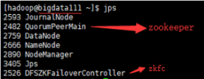
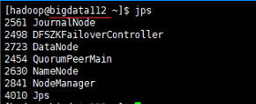
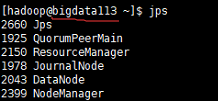
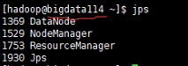
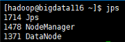

# 切换到hadoop用户并进行以下所有操作

以下暂不考虑kafka进程，kafka用来接收数据，不是每个集群都必须用kafka来接收数据

- 启动顺序：
  先启动zookeeper集群
  再启动HDFS模块
  再启动YARN模块
  再启动MR历史服务器
- 关闭顺序：
  先关闭MR历史服务器
  再关闭YARN模块
  再关闭HDFS模块
  再关闭zookeeper集群

## HDFS模块启停

### HdFS模块的所有进程

zkfc是用来做健康监测的，可以查看前面的hdfs架构图的参考链接

**注意：**
	zkfc是在各个namenode节点上启动（关闭）
	journalnode是在hdfs-site.xml配置文件中指定的节点上启动（关闭）
	namenode是在hdfs-site.xml配置文件中指定的节点上启动（关闭），无论是最终是active还是standby，启动多个namenode时，第一个启动的会变成active
	datanode是在由slaves文件中指定的各个数据节点上启动（关闭）

- 启动（有序）：

  ```shell
  hadoop-daemon.sh start journalnode
  hadoop-daemon.sh start namenode
  hadoop-daemon.sh start zkfc
  hadoop-daemon.sh start datanode
  ```

- 停止（有序）：

  ```shell
  hadoop-daemon.sh stop datanode
  hadoop-daemon.sh stop zkfc
  hadoop-daemon.sh stop namenode
  hadoop-daemon.sh stop journalnode
  ```

## YARN模块启停
**注意：**

​	resourcemanager是在yarn-site.xml配置文件中指定的节点上启动（关闭），无论是最终是active还是standby
​	nodemanager是在由slaves文件中指定的各个数据节点上启动（关闭）

- 启动（有序）：

  ```shell
  yarn-daemon.sh start resourcemanager
  yarn-daemon.sh start nodemanager
  ```

- 停止（有序）：

  ```shell
  yarn-daemon.sh start nodemanager
  yarn-daemon.sh start resourcemanager
  ```

## MR历史服务器启停

**注意：**
	JobHistoryServer是在yarn-site.xml配置文件中指定的节点上启动（关闭）

```shell
mr-jobhistory-daemon.sh start/stop historyserver
```

## 启动检测

- HDFS启动成功检测访问如下两个地址：
  http://bigdata111:50070	(active，假设这个bigdata111上的namenode先启动)
  http://bigdata112:50070	(standby)
  两个地址都能打开且DataNode Information中显示六个节点都在线
- YARN启动成功检测访问如下两个地址：
  http://bigdata113:8088
  http://bigdata114:8088
  两个地址都能打开

### 各机器使用jps查看的进程截图



包含jps在内共7个进程



包含jps在内共7个进程



包含jps在内共6个进程



包含jps在内共4个进程


包含jps在内共4个进程



包含jps在内共3个进程