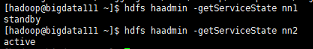
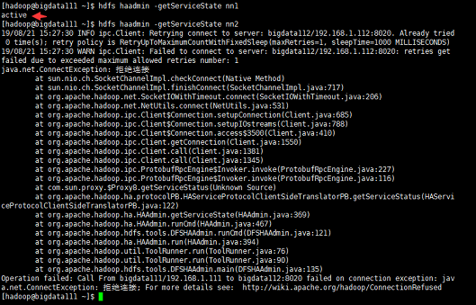
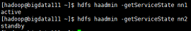
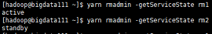
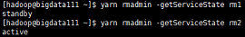

# 切换到hadoop用户并进行以下所有操作

## 基本测试
在hdfs中创建数据存入目录：

```shell
hdfs dfs -mkdir -p /home/hadoop/basetest/in
```

**注意：**

​	自己在hdfs中直接创建的文件夹，在页面上只有可读权限，没有可写（删除）权限，如果要删除，需要用命令执行
上传文件到数据存入目录：

```shell
hdfs dfs -put /home/hadoop/hadoop-2.8.5/etc/hadoop/*.xml /home/hadoop/basetest/in
```

使用hadoop包中自带的样例jar包执行单词统计测试（需要指定一个不存在的结果输出路径）

```shell
hadoop jar /home/hadoop/hadoop-2.8.5/share/hadoop/mapreduce/hadoop-mapreduce-examples-2.8.4.jar wordcount /home/hadoop/basetest/in/*.xml /home/hadoop/basetest/out
```

## HDFS组件HA测试
关键命令：

```shell
hdfs haadmin -getServiceState 自定义的namenode节点名
```

通过命令查询：

当前nn1和nn2的状态分别为standby和active



当我在nn2这个active节点上执行kill -9 杀死namenode进程时，再查看，可以发现nn1由standby节点被拉起成为active节点，而nn2无法连接



再使用hadoop-daemon.sh start namenode命令启动nn2节点，再查看



相比第一次查询，nn1和nn2的active/standby身份刚好对调，证明HDFS的高可用有效！！

也可以通过网页查看nn1和nn2的active/standby身份

## YARN组件HA测试
关键命令：

```shell
yarn rmadmin -getServiceState 自定义的resourcemanager节点名
```

查询两个rm节点的active/standby身份



用kill -9 命令杀死rm1节点的resourcemanager进程

再用```yarn-daemon.sh start resourcemanager``命令重新启动rm1节点的resourcemanager进程

然后再查看两个rm节点的active/standby身份



与最初查询刚好身份互换，说明YARN 高可用有效。